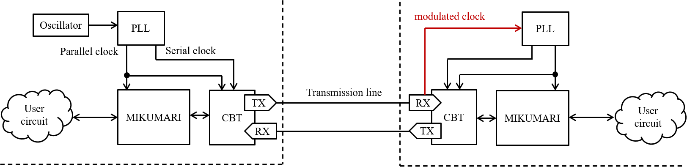
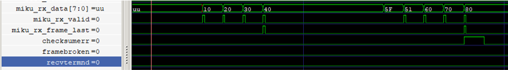

# MIKUMARI

The MIKUMARI is a clock signal, timing, and synchronous command distribution technology for front-end electronics (FEE) based on the [clock-duty-cycle-modulation (CDCM)](https://ieeexplore.ieee.org/document/9131833). By distributing a modulated clock signal based on pulse width modulation (PWM), it is possible to transmit both clock signal and data on a single transmission line while achieving clock recovery without the clock-data-recovery (CDR) circuit. MIKUMARI consists of the CDCM based transceiver (CBT) and the link layer protocol, the MIKUMARI link. The CBT provides the functionalities of the physical layer, and the MIKUMARI link defines the communication protocol between physically connected link end points.

The MIKUMARI is vender IP independent except for the serializer/de-serializer block in the CBT. Currently, the CBT is implemented for Xilinx 7-series FPGAs using the IOSERDES primitive.

## Overview

The minimum configuration of the MIKUMARI is shown in the [figure](#MIKUMARI-MIN-CONFIG). The left and right hand sides are the primary and the secondary, respectively. The purpose of the MIKUMARI is distributing the reference clock signal to all the FEEs, and then a primary module may have an oscillator. To operate the system, two skew adjusted clock signals are necessary. One is the parallel clock signal to drive the parallel data path, and the other is the serial clock signal to drive the transmission line. In many cases, the reference clock will be equal to the parallel clock. The frequency ratio between the serial and parallel clock signals is defined by the modulation pattern. If the CDCM-10-XX (See [Ref](https://ieeexplore.ieee.org/document/9131833).) is used, the developer has to prepare the 5 times faster serial clock signal than that of the parallel clock, and 4 times faster clock signal is necessary for CDCM-8-XX. The maximum transferable reference (parallel) clock frequency is determined by the maximum acceptable clock signal frequency of the clock buffer in FPGA or the maximum data rate of IO pads. For example for Kintex-7 with the speed-grate -1 and the FBG package, the maximum BUFG speed and the maximum IO rate are 625 MHz and 1250 Mbps (HP bank case), and then the maximum transferable parallel clock speed is 125 MHz with CDCM-10-XX.

In the secondary side, these clock signals are reproduced from the modulated clock signal by a PLL on FEEs. Many PLL devices, i.e., PLLs in FPGA, external PLL ICs, and external jitter cleaner ICs, will work as a clock recovery circuit. To obtain the good jitter performance, the PLL of which the phase noise in low frequency region is low should be selected. The jitter distribution depends on the selected PLL device. As discussed in [Ref](https://ieeexplore.ieee.org/document/10098185), the obtained jitter rms when using MMCM in Kintex-7 FPGA is worse than that of the external jitter cleaner IC, CDCE62002. This comes not from the main peak structure but from the tail structure mainly. In author's opinion, MMCM is enough for 1 ns TDC synchronization, but it is not enough for high-resolution TDC with the precision around 30 ps. From the view point of the clock phase uncertainty, the PLL should have a zero-delay mode. As the CDCM technique recovers the parallel clock from the modulated clock, the phase uncertainty of the recovered clock does not appear if the PLL has the zero-delay mode. This is the important difference between the CDR circuit, which reproduced the serial clock. Unavoidable phase uncertainty exists due to the frequency division.

{: #MIKUMARI-MIN-CONFIG width="95%"}

Since the MIKUMARI system aims to distribute the reference clock signal to synchronize FEEs, the connection topology of the MIKUMARI link should be a tree structure starting from a primary module. If the primary module cannot drive all FEEs, a fan-out module is necessary in intermediate layers. An example of fan-out is shown in the [figure](#MIKUMARI-FANOUT). As the CBT and the MIKUMARI link are defined as the full-duplex transceiver and the link protocol for point-to-point communication, respectively, a simple signal fan-out is not allowed. In fan-out module, the clock signals are once recovered and drive the CBTs transferring the modulated clock signal to downstream modules. In many applications, all FEEs will receive the same command from the primary module, and then TX data can be broadcasted, however, a user circuit summarizing information from the downstream modules may be necessary in the RX side. However, this is not mandatory. Since the TX and RX of the MIKUMARI link are independent, the RX port of the right side can be left open if you decide not to use the uplink data path. Since the validOutRx and frameLastOutRx signals are one-shot, the RX port and the TX ports cannot be directly connected due to the txAck cycle. Therefore, the TxElasticBuffer is necessary to connect the RX and TX ports. The TxElasticBuffer is a simple queuing buffer for adjusting CBT character transfer cycle.

{: #MIKUMARI-FANOUT width="90%"}

The MIKUMARI link does not have a routing function, and then it does not support the end-to-end (source to destination) communication. Therefore, the clock signal, timing, and synchronous data transmissions are realized by repeating the point-to-point communication in the link layer. Thus, arbitrariness exists in the connection scheme inside the fan-out module. The MIKUMARI link protocol does not include experimental specific functions. It just provides the functionalities for sending a one-shot pulse with the fixed latency and the normal data transmission using the frame structure. An upper layer protocol, which gives dedicated functions for each experiment, is additionally necessary when using this system in actual experiments.


## CDCM based transceiver (CBT)

The CBT is a physical layer of the MIKUMARI system. About the CBT, see also [Ref](https://ieeexplore.ieee.org/document/10098185). The roles of the CBT are as follows.

- Encode and decode the CDCM modulated waveform pattern
- Defines three types of CBT character using sign extension from 8-bit to 10-bit
- Initialize IOSERDES when detecting the cable (fiber) connection

Currently, the CBT supports the CDCM-10-2.5, CDCM-10-1.5, CDCM-8-2.5, and CDCM-8-1.5. Then, the frequency ratios between the serial and parallel clock signals are 5 for CDCM-10-XX and 4 for CDCM-8-XX with the double-data-rate (DDR) mode, respectively. The SDR mode is not supported. In addition, only the differential signal is supported.
**If you want to use the Local Area Common Clock Protocol (LACCP), you need to select CDCM-8-XX modes. The serdesOffset port does not work with CDCM-10-XX modes.**

### Interface of CBT

The top-level block of the CBT is **CbtLane**. The global parameters for the CBT are defined in ``defCDCM.vhd``. The CbtLane's entity port structure is as follows.

```VHDL
entity CbtLane is
  generic
    (
      -- CDCM-Mod-Pattern --
      kCdcmModWidth    : integer; -- # of time slices of the CDCM signal
      -- CDCM-TX --
      kIoStandardTx    : string;  -- IO standard of OBUFDS
      kTxPolarity      : boolean; -- If true, inverse Tx polarity
      -- CDCM-RX --
      genIDELAYCTRL    : boolean; -- If TRUE, IDELAYCTRL is instantiated.
      kDiffTerm        : boolean; -- IBUF DIFF_TERM
      kRxPolarity      : boolean; -- If true, inverts Rx polarity
      kIoStandardRx    : string;  -- IOSTANDARD of IBUFDS
      kIoDelayGroup    : string;  -- IODELAY_GROUP for IDELAYCTRL and IDELAY
      kFixIdelayTap    : boolean; -- If TRUE, value on tapValueIn is set to IDELAY
      kFreqFastClk     : real;    -- Frequency of SERDES fast clock (MHz).
      kFreqRefClk      : real;    -- Frequency of refclk for IDELAYCTRL (MHz).
      -- Encoder/Decoder
      kNumEncodeBits   : integer:= 2;  -- 1:CDCM-10-1.5 or 2:CDCM-10-2.5
      -- Master/Slave
      kCbtMode         : string;
      -- DEBUG --
      enDebug          : boolean:= false
    );
  port
    (
      -- SYSTEM port --
      srst          : in std_logic; -- Reset logics driven by clkPar. Transceiver function reset. (active high)
      pwrOnRst      : in std_logic; -- Reset logics driven by clkIndep and clkIdelayRef. (active high)
      clkSer        : in std_logic; -- From BUFG (5 x clkPar freq.)
      clkPar        : in std_logic; -- From BUFG
      clkIndep      : in std_logic; -- Independent clock for monitor
      clkIdelayRef  : in std_logic; -- REFCLK input for IDELAYCTRL. Must be independent from clkPar.
      initIn        : in std_logic; -- Re-do the initialization process. Sync with clkPar.
      tapValueIn    : in std_logic_vector(kWidthTap-1 downto 0); -- IDELAY TAP value input (active when kFixIdelayTap is true)

      -- Status --
      cbtLaneUp     : out std_logic; -- Indicates that CBT is ready for communication
      tapValueOut   : out std_logic_vector(kWidthTap-1 downto 0); -- IDELAY TAP value output
      bitslipNum    : out std_logic_vector(kWidthBitSlipNum-1 downto 0); -- Number of bitslip made
      serdesOffset  : out signed(kWidthSerdesOffset-1 downto 0);
      firstBitPatt  : out CdcmPatternType; -- ISERDES output pattern after finishing the idelay adjustment

      -- Error --
      patternErr    : out std_logic; -- Indicates CDCM waveform pattern is collapsed.
      idelayErr     : out std_logic; -- Attempted bitslip but the expected pattern was not found.
      bitslipErr    : out std_logic; -- Bit pattern which does not match the CDCM rule is detected.
      watchDogErr   : out std_logic; -- Watch dog can't eat dogfood within specified time. The other side seems to be down.

      -- Data I/F --
      isKTypeTx     : in std_logic; -- 1: Generate a K type character. 0: D type character.
      dataInTx      : in CbtUDataType;
      validInTx     : in std_logic; -- 1: charIn is valid. Encode and send it to CDCM-TX.
                                    -- 0: Send idle pattern;
      txBeat        : out std_logic; -- Indicates encoder cycle.
      txAck         : out std_logic; -- Acknowledge to validInTx.

      isIdleRx      : out std_logic; -- Indicates present character is idle.
      isKTypeRx     : out std_logic; -- 1: K type character. 0: D type character.
      dataOutRx     : out CbtUDataType;
      validOutRx    : out std_logic; -- 1: charOut is valid.

      -- CDCM ports --
      cdcmTxp       : out std_logic; -- Connect to TOPLEVEL port
      cdcmTxn       : out std_logic; -- Connect to TOPLEVEL port
      cdcmRxp       : in std_logic;  -- Connect to TOPLEVEL port
      cdcmRxn       : in std_logic;  -- Connect to TOPLEVEL port
      modClock      : out std_logic  -- CDCM modulated clock.

    );
end CbtLane;
```

<table class="vmgr-table">
  <thead><tr>
    <th class="nowrap"><span class="mgr-10">Port </span></th>
    <th class="nowrap"><span class="mgr-10">In/Out</span></th>
    <th class="nowrap"><span class="mgr-10">Comment</span></th>
  </tr></thead>
  <tbody>
  <tr><td class="tcenter" colspan=4><b>Generic port</b></td></tr>
  <tr>
    <td>kCdcmModWidth</td>
    <td class="tcenter">-</td>
    <td>Select 8 or 10 for CDCM-8-XX and CDCM-10-XX, respectively.</td>
  </tr>
  <tr>
    <td>kIoStandardTx</td>
    <td class="tcenter">-</td>
    <td>Tx port IO standard, e.g., LVDS.</td>
  </tr>
  <tr>
    <td>kTxPolarity</td>
    <td class="tcenter">-</td>
    <td>If it's true, the TX signal polarity is reversed. Use it when the differential signal p/n connection is inverse on FEE.</td>
  </tr>
  <tr>
    <td>genIDELAYCTRL</td>
    <td class="tcenter">-</td>
    <td>If it's true, the IDELAYCTRL primitive is instantiated in the CBT.</td>
  </tr>
  <tr>
    <td>kDiffTerm</td>
    <td class="tcenter">-</td>
    <td>Enable the internal 100-ohm termination register in FPGA.</td>
  </tr>
  <tr>
    <td>kRxPolarity</td>
    <td class="tcenter">-</td>
    <td>If it's true, the RX signal polarity is reversed. Use it when the differential signal p/n connection is inverse on FEE.</td>
  </tr>
  <tr>
    <td>kIoDelayGroup</td>
    <td class="tcenter">-</td>
    <td>Set the IODELAY_GROUP constraint to the IDELAYCTRL and IDELAYE2 primitives in the CBT.</td>
  </tr>
  <tr>
    <td>kFixIdelayTap</td>
    <td class="tcenter">-</td>
    <td>If it is true, the automatic IDELAY tap adjustment function is disabled. Instead, the value on tapValueIn is set to IDELAY.</td>
  </tr>
  <tr>
    <td>kFreqFastClk</td>
    <td class="tcenter">-</td>
    <td>The frequency value of the serial clock. It is used to determine the tap number for adjusting IDELAYE2</td>
  </tr>
  <tr>
    <td>kFreqRefClk</td>
    <td class="tcenter">-</td>
    <td>The frequency value for IDELAYCTRL. It is used to determine the tap number for adjusting IDELAYE2</td>
  </tr>
  <tr>
    <td>kNumEncodeBits</td>
    <td class="tcenter">-</td>
    <td>Set the payload size of the CDCM signal. Set 1 or 2. 1: CDCM-10-1.5. 2: CDCM-10-2.5. Currently, CDCM-8-2.5 is not supported.</td>
  </tr>
    <td>kCbtMode</td>
    <td class="tcenter">-</td>
    <td>Set Master or Slave. The CBT runs with the designated mode.</td>
  </tr>
  </tr>
    <td>enDebug</td>
    <td class="tcenter">-</td>
    <td>Enable preset mark_debug constraints. The debug core will be implemented.</td>
  </tr>
  <tr><td class="tcenter" colspan=4><b>IO port</b></td></tr>
  <tr>
    <td>srst</td>
    <td class="tcenter">In</td>
    <td>Asynchronous assert, synchronous de-assert reset. Reset logics driven by clkPar. It is expected that this reset comes from the PLL lock signal generating clkPar and clkSer signals. (active high) </td>
  </tr>
  <tr>
    <td>pwrOnRst</td>
    <td class="tcenter">In</td>
    <td>This signal resets logics driven by clkIndep and clkIdelayRef. It is expected that this signal goes high once after power on, and thus it is generated by the PLL lock signal generating clkIndep and clkIdelayRef. (active high) </td>
  </tr>
  <tr>
    <td>clkSer</td>
    <td class="tcenter">In</td>
    <td>Serial clock input. The clock skew must be adjusted between clkSer and clkPar.</td>
  </tr>
  <tr>
    <td>clkPar</td>
    <td class="tcenter">In</td>
    <td>Parallel clock input. The clock skew must be adjusted between clkSer and clkPar. Status, error, and Data I/F ports are synchronized with this clock.</td>
  </tr>
  <tr>
    <td>clkIndep</td>
    <td class="tcenter">In</td>
    <td>The independent clock from the clkPar. Its clock frequency should be clkPar < clkIndep < 2*clkPar. If the frequency is exactly twice of clkPar, you could get a trouble.</td>
  </tr>
  <tr>
    <td>clkIdelayRef</td>
    <td class="tcenter">In</td>
    <td>REFCLK input for IDELAYCTRL. It must be independent from clkPar.</td>
  </tr>x
  <tr>
    <td>initIn</td>
    <td class="tcenter">In</td>
    <td>If it is high, the CBT re-do the initialization process. This signal must be synchronized with clkPar.</td>
  </tr>
  <tr>
    <td>tapValueIn</td>
    <td class="tcenter">In</td>
    <td>IDELAY TAP value input. This port is active if kFixIdelayTap is true.</td>
  </tr>
  <tr>
    <td>cbtLaneUp</td>
    <td class="tcenter">Out</td>
    <td>This goes high when the CBT becomes ready for communication after finishing the initialization process. </td>
  </tr>
  <tr>
    <td>tapValueOut</td>
    <td class="tcenter">Out</td>
    <td>The IDELAY tap value currently used. </td>
  </tr>
  <tr>
    <td>bitslipNum</td>
    <td class="tcenter">Out</td>
    <td>The number indicating how many bitslip is made in the initialization process.</td>
  </tr>
  <tr>
    <td>serdesOffset</td>
    <td class="tcenter">Out</td>
    <td>The port provides the value indicating the phase difference between the input bit patter and the ClkPar signal. This is the special port for LACCP, not for users. This port works only with CDCM-8-XX modes. </td>
  </tr>
  <tr>
    <td>firstBitPatt</td>
    <td class="tcenter">Out</td>
    <td>This port provides the bit pattern before starting the bit-slip process. This is for debug, not for users. </td>
  </tr>
  <tr>
    <td>patternErr</td>
    <td class="tcenter">Out</td>
    <td>This goes high when the waveform, which is not matched with the CDCM modulation pattern, is detected. Data is broken. </td>
  </tr>
  <tr>
    <td>idelayErr</td>
    <td class="tcenter">Out</td>
    <td>This goes high if the appropriate tap value, which provides the stable communication, was not found. </td>
  </tr>
  <tr>
    <td>bitslipErr</td>
    <td class="tcenter">Out</td>
    <td>This goes high when the reference bit pattern cannot be detected during the initialization process. Re-initialization is necessary.</td>
  </tr>
  <tr>
    <td>watchDotErr</td>
    <td class="tcenter">Out</td>
    <td>This goes high when the watch dog timer can't eat dogfood within specified time. The other side link seems to be down.</td>
  </tr>
  <tr>
    <td>isKTypeTx</td>
    <td class="tcenter">In</td>
    <td>If this is high, the current TX data is translated to a K-type character. If low, the TX data becomes a D-type character.</td>
  </tr>
  <tr>
    <td>dataInTx</td>
    <td class="tcenter">In</td>
    <td>8-bit TX data.</td>
  </tr>
  <tr>
    <td>validInTx</td>
    <td class="tcenter">In</td>
    <td>It denotes that the current dataInTx is valid. It is the request for the CBT to transmit it.</td>
  </tr>
  <tr>
    <td>txBeat</td>
    <td class="tcenter">Out</td>
    <td>This signal goes high once per a CBT character transfer cycle for one clock cycle. It indicates a boundary of the transfer cycle.</td>
  </tr>
  <tr>
    <td>txAck</td>
    <td class="tcenter">Out</td>
    <td>The acknowledge signal respect to validInTx. This goes high when the dataInTx is latched at the same timing of the txBeat.</td>
  </tr>
  <tr>
    <td>isIdleRx</td>
    <td class="tcenter">Out</td>
    <td>This goes high when the current dataOutRx is a idle data.</td>
  </tr>
  <tr>
    <td>isKTypeRx</td>
    <td class="tcenter">Out</td>
    <td>This goes high when the current dataOutRx is a K-Type data.</td>
  </tr>
  <tr>
    <td>dataOutRx</td>
    <td class="tcenter">Out</td>
    <td>8-bit RX data.</td>
  </tr>
  <tr>
    <td>validOutRx</td>
    <td class="tcenter">Out</td>
    <td>This goes high when the current dataOutRX valid both for D- and K-types data.</td>
  </tr>
  <tr>
    <td>cdcmTxp</td>
    <td class="tcenter">Out</td>
    <td>Transmission line positive. Connect to the toplevel port.</td>
  </tr>
  <tr>
    <td>cdcmTxn</td>
    <td class="tcenter">Out</td>
    <td>Transmission line negative. Connect to the toplevel port.</td>
  </tr>
  <tr>
    <td>cdcmRxp</td>
    <td class="tcenter">In</td>
    <td>Receive line positive. Connect to the toplevel port.</td>
  </tr>
  <tr>
    <td>cdcmRxn</td>
    <td class="tcenter">In</td>
    <td>Receive line negative. Connect to the toplevel port.</td>
  </tr>
  <tr>
    <td>modClock</td>
    <td class="tcenter">Out</td>
    <td>The CDCM modulated clock output. It is valid in the secondary mode.</td>
  </tr>
</tbody>
</table>

### CBT characters

The CBT character is a 10-bit internal data format in the CBT and is generated by simply adding 2-bit type header to a 8-bit data. There are K-, D-, and T-types characters. In addition, there is a IDLE character, which consists of the modulated signal with the duty ration of 50%. The T-type characters are used to control the CBT, and they are hidden inside the CBT. K-type characters are used to control the link protocol, and their bit pattern are defined in the CBT level. D-type characters are user data. The transmission request for D- and K-type characters are exclusive because it is determined by isKTypeTx signal. However, T-type character transmission can conflict with D- and K-type characters. The transmission priority among characters is defined as **D < T < K** characters. During the T-type character transmission, D-type character transmission is held up. The link protocol needs to keep the current dataInTx until the txAck is returned.

### CDCM encode and decode

Currently, the CBT supports CDCM-10-1.5 (CDCM-8-1.5) and CDCM-10-2.5; they can transmit 1-bit binary + idle pattern and 2-bit binary + idle pattern per clkPar cycle, respectively. For details, see [Ref](https://ieeexplore.ieee.org/document/9131833) and [Ref](https://ieeexplore.ieee.org/document/10098185). Since the CBT character has 10-bit data width, 10 and 5 clock cycles are necessary to send a CBT character by CDCM-10-1.5 (CDCM-8-1.5) and CDCM-10-2.5, respectively. CDCM-10-1.5 (CDCM-8-1.5) has longer latency while it provides the better jitter performance because the duty cycle change range is narrower than that of CDCM-10-2.5.

### Initialization process

The CBT starts the initialization process when the following conditions are met.

- srst and initIn are low.
- The clock monitor detects a clock like signal in the RX signal.

The IDELAYE2 tap number is adjusted so as to stabilize the sampled data using the idle pattern, and bitslip is performed so as to reproduce the bit pattern of ``0b11111_00000``. If kFixIdealyTap is true, the value on tapValueIn is set to IDEALY. After initializing IOSERDES, some T-type characters are exchanged to confirm that both end points are actually ready for communication each other. Then, the cbtLaneUp is asserted.

### Error detection

When cbtLaneUp is high, the CBT checks whether the sampled bit pattern is matched with the CDCM encoding rule or not. If a broken pattern is detected, the patternErr signal is asserted, but at this moment, the CBT is not reset. If **more than 1%** of received bit pattern are broken, the RX quality check monitor requests to reset the CBT.

When cbtLaneUp is high, the CBT transmits the T-type character, dogfood character, periodically. The dogfood character resets the watch dog timer in other side. If the watch dog timer can't eat dogfood within specified time, the watchDogErr goes high, and the watchdog timer requests to reset the CBT.

## MIKUMARI link protocol

The MIKUMARI link is a link layer protocol to establish the communication link between two end points, which are physically connected. The roles of the MIKUMARI link are as follows.

- Define the K-type characters; these are characters for the link control.
- Define a frame structure, called the MIKUMARI frame, for the data transmission
- One-shot pulse transmission with fixed latency using K-type characters.

### Interface of MIKUAMRI link

The top-level block of the MIKUMARI link is **MikumariLane**. The global parameters for the MIKUMARI link are defined in ``defMikumari.vhd``. The MikumariLane's entity port structure is as follows.

```VHDL
entity MikumariLane is
  generic
  (
    -- CBT --
    kNumEncodeBits    : integer:= 2;
    -- MIKUMARI-Link --
    enScrambler       : boolean:= true;
    kHighPrecision    : boolean:= false;
    -- DEBUG --
    enDEBUG           : boolean:= false
  );
  port
  (
    -- SYSTEM port --------------------------------------------------------------------------
    srst        : in std_logic; -- Asynchronous assert, synchronous de-assert reset. (active high)
    clkPar      : in std_logic; -- From BUFG
    cbtUpIn     : in std_logic; -- Cbt lane up signal
    linkUp      : out std_logic; -- Mikumari link is up

    -- TX port ------------------------------------------------------------------------------
    -- Data I/F --
    dataInTx      : in CbtUDataType;       -- User data input.
    validInTx     : in std_logic;          -- Indicate dataIn is valid.
    frameLastInTx : in std_logic;          -- Indicate current dataIn is a last character in a normal frame.
    txAck         : out std_logic;         -- Acknowledge to validIn signal.

    pulseIn       : in std_logic;          -- Pulse input. Must be one-shot signal.
    pulseTypeTx   : in MikumariPulseType;  -- 3-bit short message to be sent with pulse.
    pulseRegTx    : in MikumariHpmRegType; -- 4-bit additional message transferred by the pulse
    busyPulseTx   : out std_logic;         -- Under transmission of previous pulse. If high, pulseIn is ignored.

    -- Cbt ports --
    isKtypeOut  : out std_logic;
    cbtDataOut  : out CbtUDataType;
    cbtValidOut : out std_logic;
    cbtTxAck    : in std_logic;
    cbtTxBeat   : in std_logic;

    -- RX port ------------------------------------------------------------------------------
    -- Data I/F --
    dataOutRx   : out CbtUDataType;        -- User data output.
    validOutRx  : out std_logic;           -- Indicate current dataOut is valid.
    frameLastRx : out std_logic;           -- Indicate current dataOut is the last data in a normal frame.
    checksumErr : out std_logic;           -- Check-sum error is happened in the present normal frame.
    frameBroken : out std_logic;           -- Frame start position is not correctly detected
    recvTermnd  : out std_logic;           -- Frame end position of the previsou frame is not correctly detected

    pulseOut    : out std_logic;           -- Reproduced one-shot pulse output.
    pulseTypeRx : out MikumariPulseType;   -- 3-bit short message accompanying the pulse.
    pulseRegRx  : out MikumariHpmRegType;  -- 4-bit additional message transferred by the pulse

    -- Cbt ports --
    isKtypeIn   : in std_logic; --
    cbtDataIn   : in CbtUDataType;
    cbtValidIn  : in std_logic

  );
end MikumariLane;
```

<table class="vmgr-table">
  <thead><tr>
    <th class="nowrap"><span class="mgr-10">Port </span></th>
    <th class="nowrap"><span class="mgr-10">In/Out</span></th>
    <th class="nowrap"><span class="mgr-10">Comment</span></th>
  </tr></thead>
  <tbody>
  <tr><td class="tcenter" colspan=4><b>Generic port</b></td></tr>
  <tr>
    <td>kNumEncodeBits</td>
    <td class="tcenter">-</td>
    <td>Payload size of the CDCM signal. Set 1 or 2. 1: CDCM-10-1.5. 2: CDCM-10-2.5. Set the same value given for the CBT.</td>
  </tr>
  <tr>
    <td>enScrambler</td>
    <td class="tcenter">-</td>
    <td>If it's true, data scrambler is enabled. Enabling the scrambler is recommended for the better jitter performance.</td>
  </tr>
  <tr>
    <td>kHighPrecision</td>
    <td class="tcenter">-</td>
    <td>If it's true, the high-precision mode of the MIKUMARI pulse transmission is enabled.</td>
  </tr>
  </tr>
    <td>enDebug</td>
    <td class="tcenter">-</td>
    <td>Enable preset mark_debug constraints. The debug core will be implemented.</td>
  </tr>
  <tr><td class="tcenter" colspan=4><b>IO port</b></td></tr>
  <tr>
    <td>srst</td>
    <td class="tcenter">In</td>
    <td>Asynchronous assert, synchronous de-assert reset. (active high) </td>
  </tr>
  <tr>
    <td>clkPar</td>
    <td class="tcenter">In</td>
    <td>Parallel clock input; it is the identical clock as for the CBT.</td>
  </tr>
  <tr>
    <td>cbtUpIn</td>
    <td class="tcenter">In</td>
    <td>cbtLaneUp signal from the CBT. Connect to the cbtLaneUp port directly.</td>
  </tr>
  <tr>
    <td>linkUp</td>
    <td class="tcenter">Out</td>
    <td>This goes high when the link connection is established. If this is high, access to the data I/F ports are valid.</td>
  </tr>
    <td>dataInTx</td>
    <td class="tcenter">In</td>
    <td>8-bit user data input, the frame payload.</td>
  </tr>
  <tr>
    <td>validInTx</td>
    <td class="tcenter">In</td>
    <td>It denotes that the current dataInTx is valid. It is the request for the MIKUMARI link to transmit it.</td>
  </tr>
  <tr>
    <td>frameLastInTx</td>
    <td class="tcenter">In</td>
    <td>This signal indicates that the current dataInTx is last 1-byte in this frame transmission cycle. If the MIKUMARI link detects this signal, the frame checksum and the frame-end K-type character (FEK) are inserted.</td>
  </tr>
  <tr>
    <td>txAck</td>
    <td class="tcenter">Out</td>
    <td>The acknowledge signal respect to validInTx. This goes high when the dataInTx is latched.</td>
  </tr>
  <tr>
    <td>pulseIn</td>
    <td class="tcenter">In</td>
    <td>One-shot pulse input, equal to the pulse transmission request. If the MIKUMARI link detects this signal when the busyPulseTx is low, the pulse K-type character is inserted. Pulse transmission request has higher priority than the validInTX. <b>Pulse width must be one-shot, 1 clock cycle.</b></td>
  </tr>
  <tr>
    <td>pulseTypeTx</td>
    <td class="tcenter">In</td>
    <td>Pulse type input. This type value is transmitted together with a one-shot pulse. Currently, the pulse type width is 3-bit, and the 8-types of pulses can be transferred. The type value is latch when the pulseIn is high.</td>
  </tr>
  <tr>
    <td>pulseRegTx</td>
    <td class="tcenter">In</td>
    <td>The 4-bit extra data to be transmitted together with a one-shot pulse. This port is active only with the high-precision mode. The value is latch when the pulseIn is high.</td>
  </tr>
  <tr>
    <td>busyPulseTx</td>
    <td class="tcenter">Out</td>
    <td>Busy signal for pulse transmission. When it is high, the pulseIn input is ignored.</td>
  </tr>
  <tr>
    <td>isKtypeOut</td>
    <td class="tcenter">Out</td>
    <td>It indicates that the current cbtDataOut is a K-type character. Connect to isKtypeTx of the CbtLane.</td>
  </tr>
  <tr>
    <td>cbtDataOut</td>
    <td class="tcenter">Out</td>
    <td>8-bit data for the CBT. Connect to dataInTx of the CbtLane.</td>
  </tr>
  <tr>
    <td>cbtValidOut</td>
    <td class="tcenter">Out</td>
    <td>It indicates that the current cbtDataOut is valid. Connect to validInTx of the CbtLane.</td>
  </tr>
  <tr>
    <td>cbtTxAck</td>
    <td class="tcenter">In</td>
    <td>Acknowledge from the CBT respect to cbtValidOut. Connect to txAck of the CbtLane.</td>
  </tr>
  <tr>
    <td>cbtTxBeat</td>
    <td class="tcenter">In</td>
    <td>The boundary of the CBT character transfer cycle. Connect to txBeat of the CbtLane.</td>
  </tr>
  <tr>
    <td>dataOutRx</td>
    <td class="tcenter">Out</td>
    <td>8-bit user data output, received frame payload.</td>
  </tr>
  <tr>
    <td>validOutRx</td>
    <td class="tcenter">Out</td>
    <td>Data valid. If this is high, the current dataOutRx is valid.</td>
  </tr>
  <tr>
    <td>frameLastRx</td>
    <td class="tcenter">Out</td>
    <td>This goes high when the current dataOutRx is last 1-byte of the received frame payload.</td>
  </tr>
  <tr>
    <td>checksumErr</td>
    <td class="tcenter">Out</td>
    <td>If it is high, the checksum miss match is happened in the present MIKUMARI frame.</td>
  </tr>
  <tr>
    <td>frameBroken</td>
    <td class="tcenter">Out</td>
    <td>This signal goes high if the frame data body is received without detecting FSK. This indicates the communication error.</td>
  </tr>
  <tr>
    <td>recvTermnd</td>
    <td class="tcenter">Out</td>
    <td>This signal goes high if FSK is received without detecting FEK. It means that some communication troubles happen during the previous frame receive. </td>
  </tr>
  <tr>
    <td>pulseOut</td>
    <td class="tcenter">Out</td>
    <td>Received one-shot pulse output.</td>
  </tr>
  <tr>
    <td>pulseTypeRx</td>
    <td class="tcenter">Out</td>
    <td>Received pulse type value. The value when pulseOut is high is valid.</td>
  </tr>
  <tr>
    <td>pulseRegRx</td>
    <td class="tcenter">Out</td>
    <td>Received extra 4-bit data value. The value when pulseOut is high is valid.</td>
  </tr>
  <tr>
    <td>isKtypeIn</td>
    <td class="tcenter">In</td>
    <td>It indicates that the current dataOutRx is a K-type character. Connect to isKTypeRx of the CbtLane.</td>
  </tr>
  <tr>
    <td>cbtDataIn</td>
    <td class="tcenter">In</td>
    <td>8-bit data from the CBT. Connect to dataOutRx of the CbtLane.</td>
  </tr>
  <tr>
    <td>cbtValidIn</td>
    <td class="tcenter">In</td>
    <td>It indicates that the current cbtDataIn is valid. Connect to validOutRx of the CbtLane.</td>
  </tr>
</tbody>
</table>

### MIKUMARI frame and data transmission

The MIKUMARI protocol transmits the data using a simple frame structure, called the MIKUMARI frame. The frame consists of four blocks as follows.

- Frame start K-type character (FSK)
- Arbitral length data body (payload)
- 8-bit checksum
- Frame end K-type character (FEK)

The frame structure is similar that of [Xilinx Aurora 8b/1b](https://japan.xilinx.com/products/intellectual-property/aurora8b10b.html) protocol. Inserting FSK, FEK, and checksum are done by the MIKUMARI link, and later two are inserted after detecting frameLastInTx. At the receiver side, frameLastOutRx assertion and checksum calculation are performed after detecting the FEK. **Note that 8-bit checksum data does not appear from dataOutRx. It is internally used.** About details of the frame structure, see also [Ref](https://ieeexplore.ieee.org/document/10098185).

Since the frame body and 8-bit checksum data are D-type character, their transmission request can be blocked by the T-type character transmission by the CBT. If it is blocked, the txAck is not returned at the expected timing, the upper layer protocol needs to keep the current dataInTx and validInTx until txAck is returned. It is defined that pulse K-type characters have higher priority to other K-type character in this protocol. Thus, FSK and FEK insertion can be delayed by pulse transmission request. Therefore, the data transmission latency using the MIKUMARI frame is not perfectly fixed. Use the pulse transfer function for usages where arrival times must be strictly controlled.

The data interface of the MIKUMARI link is also similar to that of [Xilinx Aurora 8b/1b](https://japan.xilinx.com/products/intellectual-property/aurora8b10b.html) protocol (AXI4-stream). As there is the CBT character transmission cycle, txAck signal is used instead of tready signal.

The time chart for MIKUMARI data transmission is shown in the [figure](#MIKU-TX-TIME). The upper layer protocol sets the next data after detecting txAck high. If the data is last 1-byte of the frame body, assert frameLastInTx and keep it high until the next txAck high. The data 'D' is the 1st 1-byte of the data body in the next frame. We can suspend the data transmission by de-asserting validInTx. If validInTx is low at the txBeat timing, idle character is sent.

{: #MIKU-TX-TIME width="100%"}

The time char for MIKUMARI data receive is shown in the [figure](#MIKU-RX-TIME). The validOutRx goes high when the dataOutRx is valid. If the dataOutRx is the last 1-byte of the frame, frameLastOutRx goes high at the same timing of validOutRx. After that, as checksum and K-type character receive continues, user data in the next frame will not appear immediately. Sometimes, validOutRx will not go high at the expected timing due to idle character receive or conflicting with K- or T-type characters.

{: #MIKU-RX-TIME width="100%"}

### Pulse transmission

From version 2.0, the MIKUMARI-link protocol supports the high-precision mode for the pulse transmission. The original mode is called the low-latency mode to distingush them.

**Low-latency mode**

The pulse transmission with pulse types is realized by using K-type characters. The pulse type and the transmission request timing are encoded to a K-type character, and it is transmitted with highest priority. The receiver side decodes the received pulse K-type character and reproduces the pulse timing and the pulse type value. While the CBT character transmission is accepted once per 5 or 10 clock cycles, the pulse transmission can be requested at any timing. Due to the internal process realizing this feature, an additional idle character transmission is necessary after the pulse K-type character transmission. Therefore, the busy length for a pulse transfer is 10 and 20 clock cycles for CDCM-10-2.5 (CDCM-8-2.5) and CDCM-10-1.5 (CDCM-8-1.5), respectively. This limits the maximum pulse frequency. In addition, transmission of several pulse types at the same timing is also impossible.

Due to the limitation of the range of expressible bit combinations using 8-bit, the pulse K-type characters do not guarantee the DC balance of the signal on the transmission line. If the averaged duty ratio of the CDCM modulated clock is not 50%, the recovered clock signal phase is systematically shifted depending on the averaged duty ratio. This effect is visible when the pulse transfer rate is high. See [Ref](https://ieeexplore.ieee.org/document/10098185) for the details.

**High-precision mode**

The 3-bit pulse type and the 4-bit extra data are encoded to **two K-type characters.** Thus, the pulse trasmission takes longer pulse transmission latency and the busy time than thoese of the low-latency mode. For the same reason, the miximu pulse transmission rate is also decreased.
Instead, the high-precision mode ensures the DC balance perfectly. The phase shift of the recovered clock signal seen in the low-latency mode will not happen. This mode provides the better clock signal synchronization.

The author expects to use the extra 4-bit data to send information for the finer timing comepensation. For example, you can implement the 1-ns 3-bit TDC measuring the input pulse timing in the primary side (clkPar frequency is expected to be 125 MHz), and the TDC value is sent to the secondary side. Thus, you achieve the 1-ns timing trasmission.

### Data scrambler

The MIKUMARI link supports the data scrambling based on PRBS16. Since the data scrambler guarantees the DC balance on average and there is no demerit, the author strongly recommend to use it.

### Checksum error

The checksumErr goes high, if the received checksum value and the calculated value is not the same. The MIKUMARI link do nothing even if the checksum error is detected. When the error is detected, error handring is left to the upper layer protocol. This signal indicates that the communication error for D-type characters happens.
If the checksum error happens, the checksumErr signal goes high at the same timing of the frameLastRX signal as shown in the [figure](#CHECKSUM-ERR).

{: #CHECKSUM-ERR width="100%"}

### Frame broken

The data frame of the MIKUMARI-link protocol is defined as the D-type characters sandwitched by FSK and FEK.
The frame broken signal goes high, if the D-type characters are received without detecting FSK.
Since the frame starting position is unknown, all the data in this frame are invalid.
The frame broken signal goes high instead of the validOutRx signal as shown in the [figure](#FRAME-BROKEN).

{: #FRAME-BROKEN width="100%"}

### Receive terminated

The recvTernd signal represents taht the frame receive process is terminated.
This signal goes high if the FSK is received without detecting the FEK for the previous frame as shown in the [figure](#RECV-TERM).
Since the frame end position of the 1st frame in the [figure](#RECV-TERM), the frame receive is terminated and it restarts immediately.
Then, the 2nd frame in the [figure](#RECV-TERM) is valid.

{: #RECV-TERM width="100%"}

## MikumariBlock

The MikumariBlock is a wrapper module including the CbtLane and the MikumariLane. The intermediate signals between the CBT and the MIKUMARI link are hidden. For users, the author recommends to use the MikumariBlock. The almost all MikumariBlock entity ports are directly connected to the CBT and the MikumariLane entity ports. The reset input to the MikumariBlock is asynchronous.

