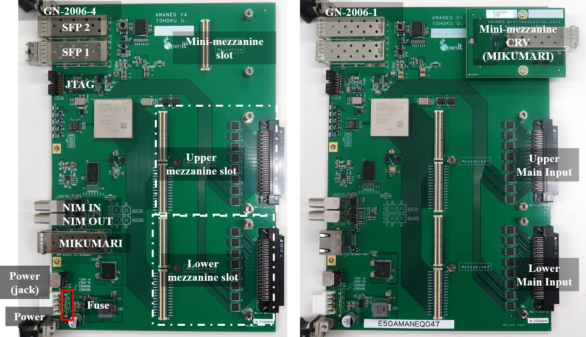
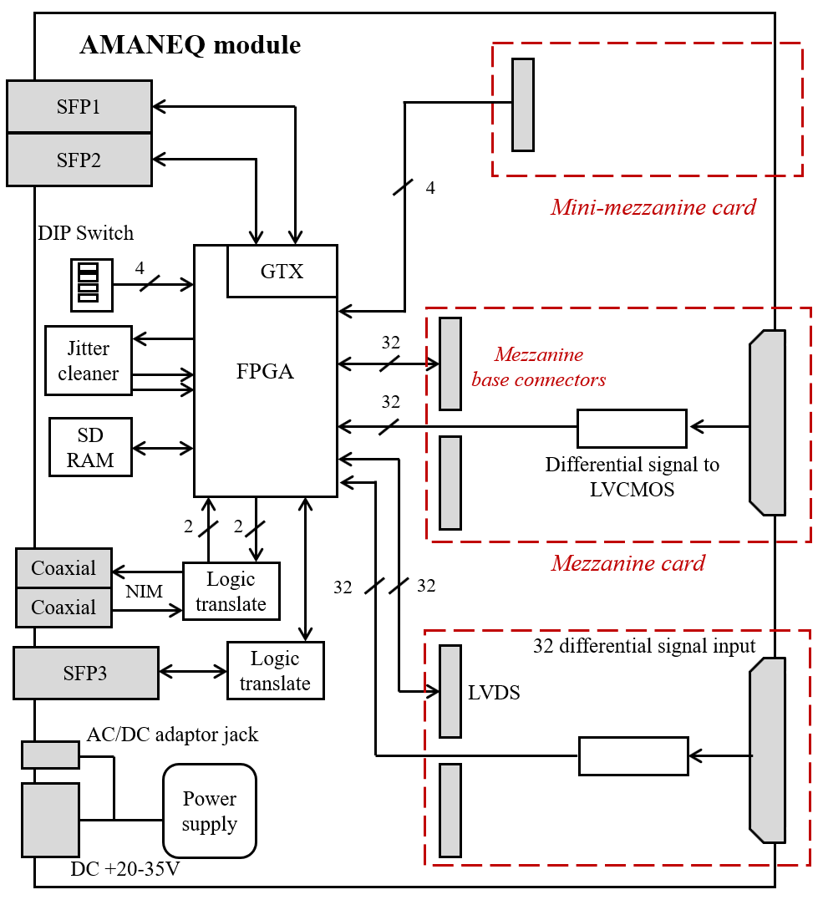
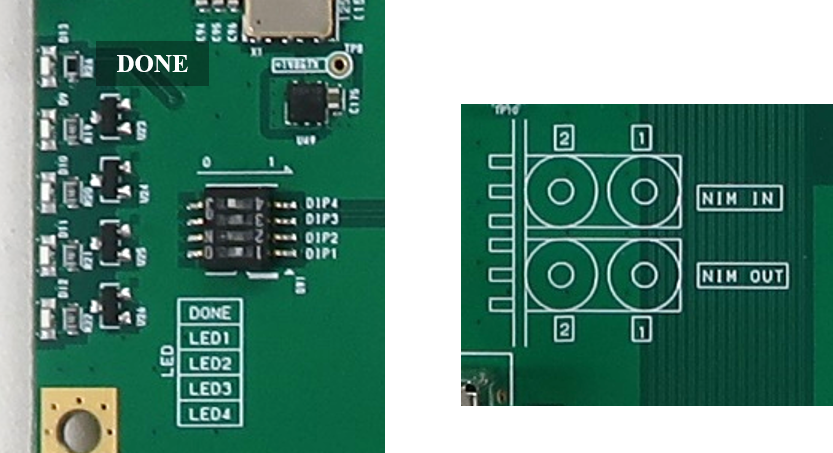
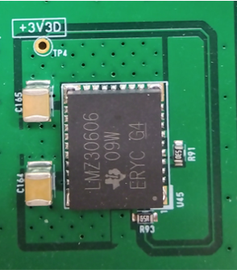

# Overview

AMANEQ (a main electronics for network oriented trigger-less data acquisition system) はトリガーレスDAQシステムのために開発された汎用FPGA回路です。
和名は連続読み出しDAQ用フロントエンド主回路ですが、原則として英名表記を使ってください。
現在では汎用回路として紹介していますが、もともとはJ-PARC E50実験用の主回路として開発された歴史を持ちます。

- 製造: 有限会社ジー・エヌ・ディー
- 型番: GN-2006-4 (初期型: GN-2006-1)
    - GN-2006-2は特定の実験だけ所持者がいます
    - GN-2006-3は欠番です

AMANEQの写真を[図](#AMANEQ-PIC)に示します。
AMANEQはVME 6Uサイズの回路基板ですが、VMEバスを有しておらず前面と背面両方にIO用のコネクタが搭載されてています。
前面には上から2つのデータリンク用SFP+、JTAGコネクタ、LED、NIM入出力、クロック信号同期ポート（MIKUMARI）、および電源コネクタが配置されています。
背面には2つの主入力 (Main Input)と2つのメザニンスロット、および小型メザニンスロットが配置されています。
メザニンスロット[Hadron Universal Logic (HUL)](https://openit.kek.jp/project/HUL/HUL)と互換になっており、HUL用に開発されたメザニンカードを取り付ける事が可能です。
搭載FPGAはAMD Xilinx社のKintex-7 FPGA, XC7K-160T-2FFG676Cです。
またボード上にはクロックジェネレータCDCE62002 (TI)が搭載されており、FPGA内のMMCMよりも低ジッタ―クロック信号が必要な場合利用します。
トリガーレスDAQでは連続的にデータをPCへ向けてストリーミングするため、データドロップを回避するために大きなメモリが必要になります。
そのため、AMANEQは2GbのDDR3-SDRAMを搭載しています。
AMANEQのスペックについて以下のようにまとめます。

- Size: VME 6U
- FPGA: AMD Xilinx XC7K-160T-2FFG676C
- Flash memory: CYPRESS S25FL128SAGMFIR01
- Data links: SFP+ (10 Gbps x 2 in maximum)
    - Link media depends on the type of SFP modules.
- Num of NIM input: 2 (LEMO)
- Num of NIM output: 2 (LEMO)
- Power supply: 20-35V DC
    - Jack: 2.10mm ID, 5.50mm OD
    - Main connector: 日本圧着端子 S4P-VH(LF)(SN)
- Fuse limit: 1A
    - Fuse product: Littelfuse 0251001.NRT1L
- Main inputs
    - Num of channels: 32+32
    - Connector: KEL 8831E-068-170L-F
    - Supported IO standard: LVDS, ECL, PECL
    - GND pin position: A1, A2, B1, B2 (A1 and B1 are located below the polarity mark.)
- Num. of mezzanine slots: 2
    - Compatible with HUL
- Num of LED: 4
- Num of DIP switch bits: 4
- Clock generator IC: TI CDCE62002
- External memory: 2Gb DDR3-SDRAM
    - Speed: DDR3-1333 (max)

{: #AMANEQ-PIC width="100%"}

{: #AMANEQ-BLOCK width="70%"}

## Difference between GN-2006-4 and GN-2006-1

2つのバージョンの違いは前面にクロック同期（MIKUMARI）用のSFPポートがあるか無いかです。
GN-2006-1にはMIKUMARIポートが無いため、[図](#AMANEQ-PIC)にあるようにmini-mezzanine card CRVを搭載してクロック信号同期を受けてください。
この違いによりFPGAファームウェアはGN-2006-1用とGN-2006-4用に2種類存在します。
右上のmini-mezzanine slotはGN-2006-4でも有効のため、CRVを搭載すればGN-2006-1用のファームウェアはGN-2006-4でも動きますが、逆は成り立ちません。

## Board interface

### Main input

AMANEQにバックプレーンが存在しないので、前後両方に入出力が存在します。後ろ側には2つのメイン入力 (Main Input) が存在します。これらはHULのメイン入力と互換です。上側をUpper Main Input、下側をLower Main Input Lとします。

コネクタはハーフピッチの68極コネクタ（KEL 8831E-068-170L-F）です。適合するコネクタでケーブルを作成して接続してください。チャンネルアサインはコネクタの基準マーカー側が若い番号になります。GND接続はA1A2、およびB1B2の2ペア (基準マーカー直下) です。コモンモードレンジで-4Vから+5Vまでの差動信号をサポートします。LVDS、ECL、PECL、LVPECLなどがサポート対象です。ECLおよびPECL信号規格を利用する場合、AMANEQ側には電流制限抵抗が存在しないため、ドライバ側で電流制御されている必要があります。

メイン入力では差動信号をLVCMOSに変換してからFPGAへ入力します。最高繰り返しスピードは560 Mbpsです。それよりも高速な信号を入力する場合メザニンカードの使用を検討してください。

### SFP1, 2

データ通信用のSFP+ポートです。FPGAのGTXトランシーバへ接続されています。最大通信速度は10 Gbpsです。SFPおよびSFP+モジュールが適合します。SFP1と2の利用方法は各ファームウェアに依存します。

[SiTCP](https://www.bbtech.co.jp/sitcp/)ないし[SiTCP-XG](https://www.bbtech.co.jp/products/sitcp-xg-license/)を利用したファームウェアでは、このポートへGbE用か10GbE用のSFPモジュールを挿入してください。
SFPモジュールは多数の選択肢が存在しますが、複数の通信レートに対応したモジュール、例えば1Gbps、100Mbps、10Mbpsの3種類に対応したもの、は利用しないでください。オートネゴシエーションがうまく働かないためです。SiTCPではれば1Gbps専用の物を、SiTCP-XGであれば10Gbps専用の物を選択してください。

SFPモジュールは光ファイバーケーブルをリンクメディアに想定した規格ですが、LANケーブルに対応したRJ45付きモジュールも存在します。AMANEQでも光ファイバーの使用を想定していますが、SiTCPを搭載したファームウェアではLANケーブル用のSFPモジュールでも利用可能です。一方SiTCP-XGではLANケーブルを用いた10GbE通信は未テストです。

### DIP, LED, NIM

{: #LED-DIP-NIM width="75%"}

縦に5つ並んだLEDのうち一番上がDONE LEDです。このLEDはFPGAのコンフィグレーションが終了すると点灯します。残りの4つは上からLED1, 2, 3, 4とラベルされています。各LEDの意味はファームウェアに依存します。
DIPスイッチは左側が0 (ONとラベルされている側)、右側が1と定義されています。各ビットの意味はファームウェアに依存します。
NIM入出力は基板上側が入力、下側が出力です。AMANEQのNIM出力はNIM信号規格へ変換する部分で簡略化した方式を採用しており、 logic-highとして認識する電圧に基板差があります。そのため、同一のファームウェアでNIM出力をしたとしても、信号幅やタイミングが若干異なって見えることがあります。AMANEQのNIM入出力は補助入力と考えてください。タイミングが重要な高精度信号の入出力には向いていません。
2つあるNIM1とNIM2は基板上のシルクに印字されています。

### Power supply

電源コネクタはAD/DCアダプタ用のジャック（径 2.10mm ID, 5.50mm OD）と、外部DC電源用に日本圧着端子のS4P-VH(LF)(SN)が備わっています。
想定している電源電圧は20-35Vです。
**2つ端子は基板上でつながっており、30V程度の電圧が印加された電極がむき出し状態になります。**
ジャックへキャップをはめたり、S4Pコネクタにテープ等でカバーをしたりして感電を防いでください。
S4Pコネクタは電極が4つあり、上2つが電源、した二つがグランドです。

AMANEQではスイッチングレギュレータを用いて高い電圧から5Vへ降圧しています。このスイッチングレギュレータの仕様的に10V程度から40V程度まで入力を受け付けることができますが、下限はヒューズの電流制限で20V程度に、上限は破損を防ぐために35V程度を推奨にしています。
ヒューズは外部電源の35V系に挿入されており、電流リミットは1Aです。20V以下の電源電圧ではヒューズが切れるので、印加しないでください。また、同じ理由からゆっくり電圧を35Vまで上げるのもやめてください。AC/DCアダプタは24V出力の物が適合しますが、出力パワーが20W程度あるものを選んでください。AMANEQ基板の消費電力はSkeletonファームウェアを除くと全て10Wを超えています。

搭載ヒューズはLitelfuseの0251001.NRT1Lです。

### MIKUMARI port

GN-2006-4にはフロント側にクロック信号同期（[MIKUMARI](https://github.com/RyotaroHonda/mikumari)）用のSFPポートが存在します。MIKUMARI使用時には1Gbps用の光ファイバー用SFPモジュールを挿入してください。LANケーブル用のモジュールは利用不可です。

GN-2006-1には同じ場所にBelle/Belle-II実験のトリガーポート (B2TT) 互換のRJ45ポートが存在しますが、全てのファームウェアでこのポートは未使用です。AMANEQが設計された当初、クロック信号分配にB2TT規格を利用する予定だったなごりです。GN-2006-1でMIKUMARIを使用するためには、mine-mezzanine clock receiver (CRV) を右上の小型メザニンスロットに搭載してください。

### Mezzanine slots

AMANEQにはHULと互換性のあるメザニンスロットが2つ搭載されており、HUL用に開発されたメザニンカードを搭載する事が出来ます。HUL用のメザニンについては[HULのページ](https://openit.kek.jp/project/HUL/HUL)を参照してください。
**基板がたわんで接続が悪くなるため、3つあるメザニンカード用の支柱のうち真ん中の1つへねじ止めをしない方針にしました。**HULでも同様なので真ん中のネジをリリースする事をお勧めします。

メザニンカードとAMANEQのFPGAは32ペアのLVDS信号線で接続されています。信号入出力の方向はファームウェアに依存するので、搭載しているメザニンカードと適合しないファームウェアをダウンロードした場合信号がショートする事があります。最悪部品を破損させるので、ファームウェアの入れ替えを行ってからメザニンは取り付けてください。メザニンへはベースコネクタから3.3Vが給電されています。

Mimi-mezzanine slotは現状GN-2006-1にMIKUMARIポートを増設するためだけに利用しています。

## Board ICs

### FPGA

FPGAはAMD XilinxのXC7K-160T-2FFG676Cです。HULのFPGAとはサイズは同じですが、スピードグレードが異なり、AMANEQではスピードグレード-2のFPGAを利用しています。GTXチャンネルで10Gbpsまでの高速通信が可能です。

### Jitter cleaner

AMANEQには2出力のクロックジェネレータ、TI社のCDCE62002が搭載されています。いくつかのファームウェアで基準クロックを生成するためや、MIKUMARIの変調クロックからクロック信号を復元するために利用されます。そのジッタ―パフォーマンスはFPGA内部のMMCMよりも優秀です。

<!-- ただし、zero-delay modeが搭載されていないため、出力ディバイダで分周を行った場合、分周比に従って位相の不定性が出ます。これを電源サイクルに対して確定的にしたい場合、各ファームウェアに搭載されている位相選択の機能を有効にしてください。 -->

納入時のCDCE62002にはファクトリーデフォルトが書き込まれており、自分で必要な設定を書き込まないとAMANEQのファームウェアは動作しません。AMANEQが納品されたらSkeletonファームウェアを書き込み、CDCE62002の設定を行ってください。このICは不揮発性メモリを持っているので、一度設定を書き込んだら以降のアクセスは必要ありません。

### DDR3-SDRAM

AMANEQには2GbのDDR3-SDRAMが搭載されています。最高動作速度はDDR3-1333です。2024年7月現在このメモリを活用したファームウェアはまだ存在しません。

### Flash memory

AMANEQのSPI flash memoryはCYPRESSのS25FL128SAGMFIR01です。Vivado上ではCypress/Spansion s25fl128sxxxxxx0-spi-x1_x2_x4を選択してください。拡張信号線を配線しているので、VivadoでbitstreamやMCSを生成するときにはSPIx4を選択してください。

## Power supply ICs

{: #3V3D"}

AMANEQでは外部入力の35VをLT8612UDE#PBFを用いて5Vへ降圧し、それを更に複数の電源電圧へ降圧しています。各電源ICのそばには[図](#3V3D)左上に示すようなテストポイントが設置されており、出力電圧を確認する事が出来ます。AMANEQ納入後の初回電源投入時に全ての電源電圧の確認を行ってください。

<table class="vmgr-table">
  <thead><tr>
    <th class="nowrap">電源ラベル</th>
    <th class="nowrap">電圧</th>
    <th class="nowrap">部品番号</th>
    <th class="nowrap">テストポイント番号</th>
  </tr></thead>
  <tbody>
  <tr>
    <td class="tcenter">+5V</td>
    <td class="tcenter">+5.0V</td>
    <td class="tcenter">U50</td>
    <td class="tcenter">なし</td>
  </tr>
  <tr>
    <td class="tcenter">+3V3D</td>
    <td class="tcenter">+3.3V</td>
    <td class="tcenter">U45</td>
    <td class="tcenter">TP4</td>
  </tr>
  <tr>
    <td class="tcenter">+2V5D</td>
    <td class="tcenter">+2.5V</td>
    <td class="tcenter">U46</td>
    <td class="tcenter">TP5</td>
  </tr>
  <tr>
    <td class="tcenter">+1V8D</td>
    <td class="tcenter">+1.8V</td>
    <td class="tcenter">U44</td>
    <td class="tcenter">TP3</td>
  </tr>
  <tr>
    <td class="tcenter">+1V0D</td>
    <td class="tcenter">+1.0V</td>
    <td class="tcenter">U43</td>
    <td class="tcenter">TP2</td>
  </tr>
  <tr>
    <td class="tcenter">+1V8GTX</td>
    <td class="tcenter">+1.8V</td>
    <td class="tcenter">U49</td>
    <td class="tcenter">TP8</td>
  </tr>
  <tr>
    <td class="tcenter">+1V2GTX</td>
    <td class="tcenter">+1.2V</td>
    <td class="tcenter">U47</td>
    <td class="tcenter">TP6</td>
  </tr>
  <tr>
    <td class="tcenter">+1V05GTX</td>
    <td class="tcenter">+1.05V</td>
    <td class="tcenter">U48</td>
    <td class="tcenter">TP7</td>
  </tr>
  <tr>
    <td class="tcenter">-3V3D</td>
    <td class="tcenter">-3.0V</td>
    <td class="tcenter">U20</td>
    <td class="tcenter">なし</td>
  </tr>
</tbody>
</table>

