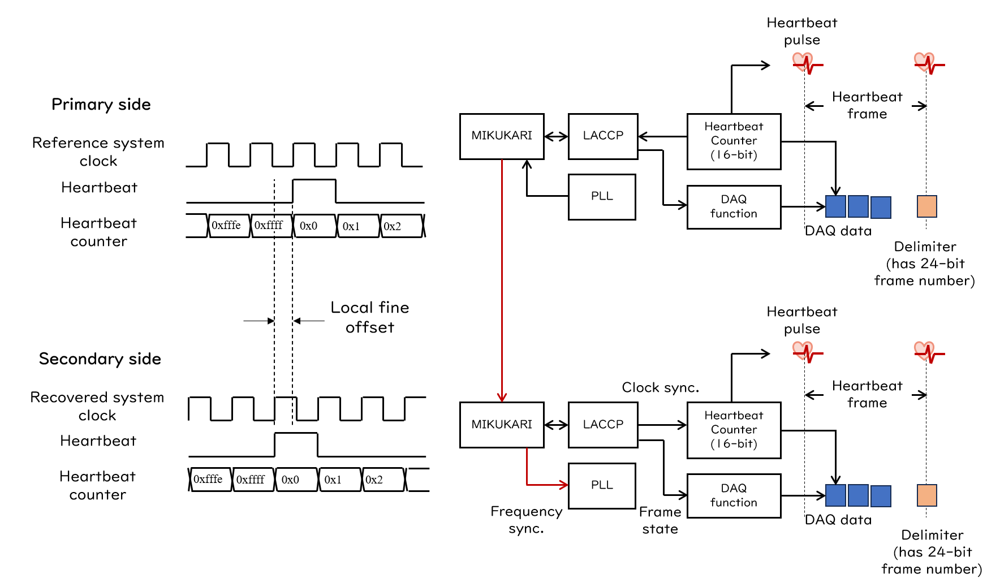

# Synchronization

連続読み出しのために開発されたAMANEQでは時刻同期が非常に重要な機能になります。
高精度時刻同期のためには、まずクロック信号を分配し周波数同期を行う必要があります。この時同時に同期データのやり取りを行いたくなるため、クロック信号とデータの両方を送信可能なリンクプロトコルが必要です。
AMANEQ、CIRASAME、RAYRAWなどのモジュールではリンク層プロトコルにMIKUMARI link protocolを採用しています。MIKUMARIはpulse-width-modulationの一種であるClock-Duty-Cycle-Modulation (CDCM)を物理層の信号変調方式に採用しています。
その上にデータを乗せる事で、MIKUMARI linkはクロック信号の周波数同期とリンク層の通信プロトコルを提供します。

時刻同期はMIKUMARI protocolの上位にLocal Area Common Clock Protocol (LACCP)を実装することで実現します。
LACCPは独自の時刻ドメインを定義し、また自身の時刻をクロック分配ネットワークのroot moduleへ合わせます。
これら2つのプロトコルを利用して、ボード間のクロック信号周波数とタイムスタンプの値を揃えます。
ここでは時刻同期の概要について説明します。
詳細を知りたい場合は以下の参考文献を参照してください。

- CDCM
    - D. Calvet, IEEE TNS, vol. 67, no. 8, 1912-1919 (2020), doi: TNS.2020.3006698.
- MIKUMARI link
    - R. Honda, IEEE TNS, vol. 70, no. 6, 1102-1109 (2023), doi: TNS.2023.3265698.
    - [User Guide](https://ryotarohonda.github.io/ug-mikumari/)
    - [Source](https://github.com/RyotaroHonda/mikumari)

## MIKUMARI link

{: #OV-MIKU width="100%"}

MIKUMARI linkには基準システムクロック信号を送信するプライマリと、変調クロック信号からシステムクロック信号を復元するセカンダリが存在ます。
プライマリ側は基準クロック信号から変調クロック信号を生成し送信します。セカンダリはこの変調クロック信号から50%デューティサイクルのクロック信号を復元する事で周波数同期を実現します。
[図](#OV-MIKU)中心に見える立下りに複数パターンが存在する信号がCDCMの変調クロック信号です。MIKUMARI linkはデータ通信を行う全二重トランシーバのため、セカンダリからプライマリ方向にも同じく変調クロック信号を送信します。
このようにMIKUMARI linkの重要な役割はシステムクロック信号の周波数同期を行う事です。
復元を行う際、セカンダリ側はクロック信号の位相関係には無頓着です。そのため、プライマリとセカンダリのシステムクロック信号間にはファイバー長に依存した位相差が出現します。
この位相差がLACCPで時刻同期を行う際に重要になります。

CDCMの特徴はFPGAのmulti-gigabit transceiver (MGT)を用いずにトランシーバを実装できる事です。そのため、これらの回路ではクロック同期ポートはFPGAの汎用ピンを用いて実装されています。
この特性をいかして、光ファイバーで接続されたボード間同期だけでなく、親ボードと子ボード上のFPGA間（例えばAMANQEとメザニンカード）の同期にもMIKUMARI linkを用います。

{: #PULSE-MIKU width="80%"}

MIKUMARI protocolにはフレームを用いたデータ通信の機能が存在しますが、それ以外に固定遅延で同期パルスを送信するという機能が備わっています。
同期パルスとはシステムクロックでサンプリングされた後のパルス信号です。
[図](#PULSE-MIKU)はパルス送信の様子のオシロスコープスクリーンショットです。上段の信号はシステムクロック信号、中段はプライマリ側が送信するパルス、下段がセカンダリ側で復元したパルスです。
図のロジック信号はNIMレベルロジックのため論理が反転しています。
ソースパルスと復元パルスの間で立ち上がりエッジが同期しており、固定遅延で同期パルスが送信で来ている事がわかります。
非同期パルスをこの機能を使って送信する場合、一度システムクロックでサンプリングするため、システムクロック周期でタイミングが量子化されます。
そのため、非同期入力のソースパルスと復元パルスのタイミングを比較すると、およそシステムクロック周期で分布します。

## LACCP

LACCPの仕事は時刻を定義し、それをroot moduleへ合わせることです。
時刻定義はハートビートカウンターと呼ばれる16-bitカウンターを元にして行われ、カウンター値をタイムスタンプとしてDAQデータに付与します。
そのため、各データが持つタイムスタンプ長は16-bitです。
ハートビートカウンターはシステムクロック信号で駆動されるフリーランカウンタです。125 MHzのクロックで駆動した場合、1カウント幅8 nsで一周に約524 usかかります。
ハートビートカウンターがキャリーオーバーする際に、ハートビート信号と言う周期的な信号を発生させます。
ハートビート信号で区切られた時間フレームの事をハートビートフレームと呼びます。このフレームには24-bit長のフレーム番号が付与されており、ハートビートカウンターと合わせて24+16-bit長のタイムスタンプを定義でき、システムクロック周波数が125 MHzの場合一周に約2.4時間かかります。
LACCPが定義する時刻はDAQ機能とは独立です。DAQ機能が走って

LACCPはハートビートタイミングとフレーム番号をFPGA間で合わせ、時刻同期を実現します。
DAQ機能にとって、ハートビートフレームがデータブロック構造の最小単位です。
<!--
 ハートビート信号のタイミングで、デリミタデータという特殊データがDAQデータの間に挿入されます。
デリミタデータは24-bit長のフレーム番号や、そのフレームのステータスサマリーなどを持っています。
-->
ハートビートフレームはDAQステートを有しており、RUNNINGとIDLEの2状態が定義されています。
RUNNINGでDAQ機能をONにして、データ送信を行います。
DAQステートの分配もLACCPの仕事です。

{: #PULSE-MIKU width="100%"}

以上の事をまとめると[図](#PULSE-MIKU)のようになります。
MIKUMARIとLACCPのクロックを提供する側がプライマリ、復元して同期する方がセカンダリです。
同期は常にプライマリとセカンダリ間の1対1で行われます。
そのFPGAがクロック分配ネットワークの頂点にあるFPGAでなくとも、常にクロック信号を送信する側がプライマリです。
ここで問題となるのが、システムクロック信号間にある位相差です。
すでに述べたようにMIKUMARIではクロック復元を行う時に位相関係に無頓着であるため、ファイバー長に依存して位相差が出ます。
LACCPによる同期はプライマリ-セカンダリ間の同期の繰り返しであるため、ボードを複数直列に接続した場合、位相差によるハートビート信号タイミングのずれは積算していきます。
結果として、リーフモジュールの時刻がルートモジュールから見て大幅にずれているという事が起こりえます。

これを解決するためにLACCPではシステムクロック信号間の位相差を測定し、ハートビートタイミングがお互いどれだけずれているかを示すlocal fine offsetを算出します。
ボードが直列に接続されている場合、中継地点のボードはlocal fine offsetを下流のボードへ送信します。
こうして上流からやってきたfine offsetと自身が算出したfine offsetの積算を取った物を**LACCP fine offset**とよび、最終的なタイムスタンプの補正に用います。
LACCP fine offsetの値が±システムクロック周期を超えた場合、LACCPはハートビートタイミングを1クロック分ずらして、LACCP fine offsetが1周期以内に収まるように調整します。
**まとめると、local fine offsetは1つ上流のボードと比較した時のハートビートタイミングの時間差、LACCPはルートモジュールからみたハートビートタイミングの時間差を示します。**

セカンダリ側はDAQデータのタイムスタンプをLACCP fine offsetで補正する事により、システムクロック周期よりもよい確度で時刻合わせを実現できます。
補正はFPGA中で行う事も出来るし、ソフトウェア上で行ってもよいです。
ただし、補正の結果DAQデータがハートビートフレームをまたいでしまう事があります。このようなフレームの端にあるデータの処理は適切に行わなくてはなりません。
